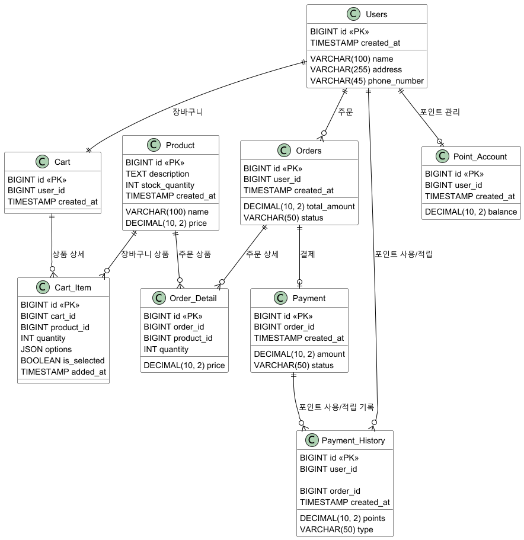

## 채택할 기본 패키지 구조


## 기술 스택
- JAVA 17
- Spring Boot 3.3.4
- Gradle build
- H2 Database
- Spring Data JPA
- JUnit5
- Mockito
- Lombok

## ERD 


## API 명세


### 상품 리스트 조회
`GET /products` 
```json
[
  {
    "productId": 100,
    "name": "긴팔티",
    "price": 20000,
    "stockQuantity": 50,
    "description": "초가을에 입기 좋은 옷",
    "createdAt": "2024-10-11T01:49:09.2982845"
  },
  {
    "productId": 200,
    "name": "청바지",
    "price": 50000,
    "stockQuantity": 10,
    "description": "사계절 내내 입기 좋은 바지",
    "createdAt": "2024-10-11T01:49:09.2982845"
  }
]
```

### Http Status
- 200 : 모든 상품 조회
- 404 : 상품이 존재하지 않음

### 상품 상세 조회 
`GET /products/{productId}`
```json
{
  "productId": 100,
  "name": "긴팔티",
  "price": 20000,
  "stockQuantity": 50,
  "description": "초가을에 입기 좋은 옷",
  "createdAt": "2024-10-11T03:38:49.9243292"
}
```

### Http Status
- 200 : 상품 상세 조회 
- 404 : 상품이 존재하지 않음

### 잔액 충전
`POST /users/{userId}/recharge`
```json
{
  "user": {
    "userId": 1,
    "name": "홍길동",
    "address": "서울시 강남구",
    "phoneNumber": "010-1234-5678",
    "createdAt": "2024-10-11T03:40:21.897126"
  },
  "balance": 50123
}
```
```json

{
  "message": "1회 충전 금액은 20만원을 초과할 수 없습니다."
}
```

### Http Status
- 200 : 잔액 충전 성공
- 400 : 잘못된 요청
- 404 : 사용자를 찾을 수 없음

### 잔액 조회
`GET /users/{userId}/balance`
```json
{
  "user": {
    "userId": 1,
    "name": "홍길동",
    "address": "서울시 강남구",
    "phoneNumber": "010-1234-5678",
    "createdAt": "2024-10-11T03:42:55.2370764"
  },
  "balance": 50000
}
```

### Http Status
- 200 : 잔액 조회 성공
- 404 : 사용자 찾을 수 없음

### 주문 및 결제
`POST /orders/create`
```json
{
  "orderId": 1,
  "userId": 1,
  "totalAmount": 20000,
  "orderStatus": "PENDING",
  "createdAt": "2024-10-11T03:55:37.1979454",
  "orderDetails": [
    {
      "productId": 100,
      "quantity": 1,
      "price": 20000
    }
  ],
  "paymentAmount": 20000,
  "paymentStatus": "COMPLETED",
  "paymentDate": "2024-10-11T03:55:37.1979454"
}
```
```json
{
  "message": "해당 상품의 재고가 부족하여 주문이 불가능합니다."
}
```
```json
{
  "message": "포인트가 부족하여 결제가 불가능합니다."
}
```

### Http Status
- 201 : 주문 및 결제 성공
- 400 : 잘못된 요청
- 404 : 사용자를 찾을 수 없음
- 409 : 포인트 부족
- 410 : 재고 부족

### 인기 상품 목록 조회 (판매량 순)
```json
[
  {
    "productId": 400,
    "name": "맨투맨",
    "price": 59000,
    "orderCount": 180
  },
  {
    "productId": 200,
    "name": "청바지",
    "price": 50000,
    "orderCount": 150
  },
  {
    "productId": 100,
    "name": "긴팔티",
    "price": 20000,
    "orderCount": 120
  },
  {
    "productId": 500,
    "name": "슬랙스",
    "price": 49000,
    "orderCount": 110
  },
  {
    "productId": 300,
    "name": "후드티",
    "price": 70000,
    "orderCount": 90
  }
]
```

### Http Status
- 200 : 인기 상품 목록 조회 성공